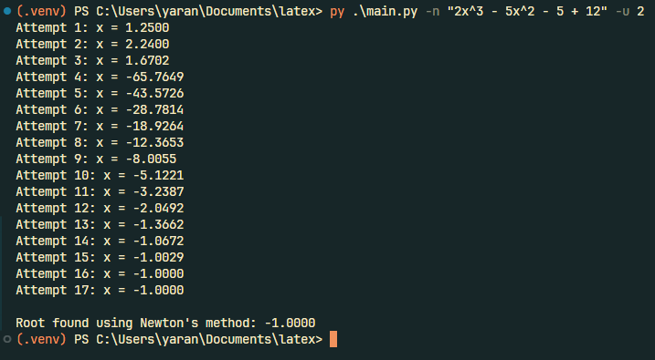

# PolyPocket

A Python script to find roots of polynomial equations that results in 0.

Still doesn't find irrational roots! This is a work in progress.

Expected results and additional explanations are in the notes.tex file, which are my supermemo brief notes on the topic (I'll work on improving those notes too).

## Example

```sh
usage: main.py [-h] (-n NEWTON | -p RATIONAL) [-u UNKNOWN]

PolyPocket ~ Polynomial Solver

Enter the equation in the format: 2x^3 - 5x^2 - 5 + 12

options:
  -h, --help            show this help message and exit
  -n, --newton NEWTON   Run Newton's method with the given equation
  -p, --rational RATIONAL
                        Run the Rational Root Theorem with the given equation
  -u, --unknown UNKNOWN
                        Initial guess for Newton's method (required with -n)
```



## To-do

### Exact (symbolic) methods
- [x] Newton's Method + Derivative
- [x] Rational Root Theorem (p/q) + Briot-Ruffini + Bhaskara (quadratic formula)
- [ ] Grouping factoring

### Numerical methods
- [ ] Bolzano’s theorem (to check if there are roots in an interval)
- [ ] Bisection method
- [ ] Durand-Kerner method

### Visualization

- [ ] Step by step visualization of the methods
- [ ] Visual representation in the terminal (?)
- [ ] Graphing with matplotlib